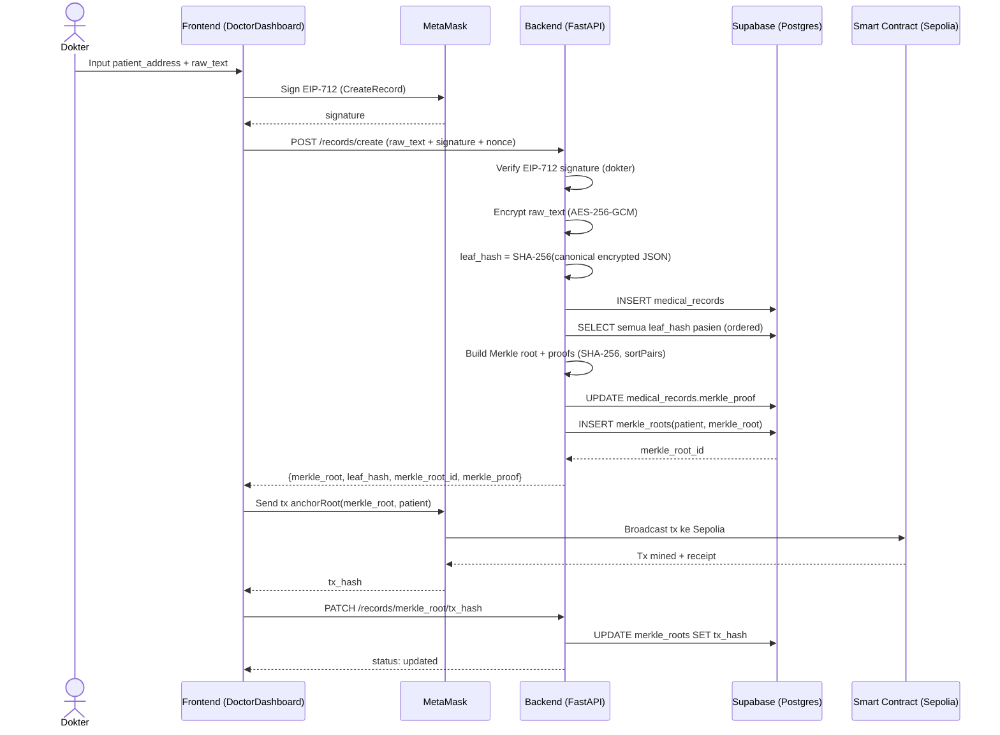
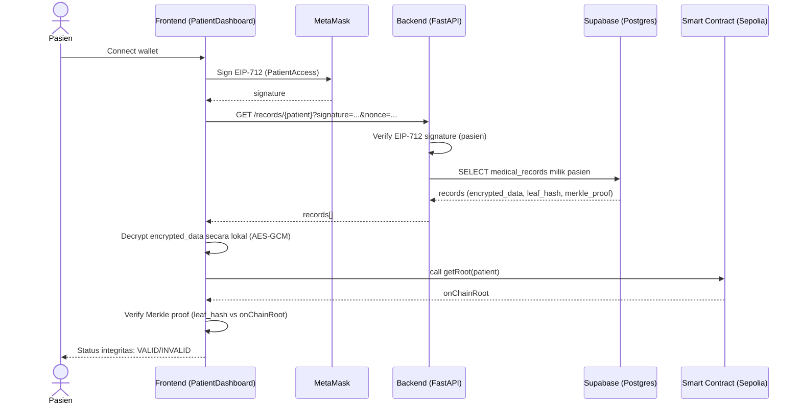

# BAB 3 — DESAIN SISTEM

Dokumen ini menjelaskan desain arsitektur, desain basis data, desain smart contract, dan alur kerja ZKP pada aplikasi **Sovereign Medical Records DApp**.

> Catatan: Diagram pada bagian 3.1 menggunakan format **Mermaid** (```mermaid```), sehingga dapat dirender pada Markdown viewer yang mendukung Mermaid.

---

## 3.1. Topologi

### 3.1.1 Diagram blok arsitektur (block architecture)

```mermaid
flowchart TB
  U[User: Dokter / Pasien] -->|Browser| FE[Frontend React (Vercel)]

  FE -->|Connect, EIP-712 Sign, Send Tx| MM[MetaMask Wallet]
  MM -->|JSON-RPC (read/call/sendRawTx)| RPC[Node Provider (Alchemy RPC)]
  RPC --> NET[Ethereum Network: Sepolia]
  NET --> SC[Smart Contract: MedicalRecordRegistry]

  FE -->|HTTPS REST (JSON)| BE[Backend API: FastAPI (Fly.io)]
  BE -->|SQL (INSERT/SELECT/UPDATE)| DB[Supabase PostgreSQL]

  subgraph OffChain[Off-chain Layer]
    BE
    DB
  end

  subgraph OnChain[On-chain Layer]
    SC
  end
```

### 3.1.2 Penjelasan komponen

1) **Frontend (React + Vite + Tailwind + ethers.js)**
- Berjalan di browser user dan di-deploy ke Vercel.
- Tanggung jawab utama:
  - UI dokter/pasien.
  - Mengakses wallet via MetaMask.
  - Membuat signature EIP-712 untuk otentikasi ke backend.
  - Mengirim transaksi anchoring ke smart contract.
  - Melakukan decrypt data medis secara lokal (client-side) dan verifikasi integritas via Merkle proof.
  - Menghasilkan ZK certificate (proof Groth16) di sisi client.

2) **MetaMask**
- Extension wallet yang menyediakan:
  - Pemilihan akun (address) dokter/pasien.
  - Penandatanganan pesan typed-data (EIP-712).
  - Penandatanganan dan pengiriman transaksi ke blockchain.

3) **Node Provider / RPC (Alchemy)**
- Menyediakan endpoint JSON-RPC yang dipakai wallet untuk:
  - Read-only call ke kontrak (misalnya `getRoot(patient)`).
  - Broadcast transaksi (misalnya `anchorRoot(...)`).

4) **Smart Contract (Ethereum Sepolia)**
- Kontrak `MedicalRecordRegistry` menyimpan **Merkle root terbaru per pasien** untuk tujuan integritas.
- Kontrak tidak menyimpan data medis, hanya commitment berupa root.
- Terdapat kontrol akses (whitelist dokter) agar hanya dokter authorized yang dapat meng-anchor root.

5) **Backend API (FastAPI)**
- Di-deploy ke Fly.io dan diakses via HTTPS.
- Tanggung jawab utama:
  - Verifikasi signature EIP-712 (dokter untuk create, pasien untuk read).
  - Enkripsi data medis sebelum disimpan.
  - Membuat hash leaf (leaf_hash) dari data terenkripsi.
  - Membangun Merkle tree, menghasilkan Merkle root dan Merkle proof.
  - Menyimpan data ke Supabase.
  - Menyimpan tx_hash anchoring (hash transaksi) untuk audit trail.

6) **Database (Supabase PostgreSQL)**
- Menyimpan:
  - Record medis dalam bentuk **terenkripsi**.
  - `leaf_hash` dan `merkle_proof` untuk verifikasi integritas.
  - Riwayat `merkle_root` per pasien dan `tx_hash` hasil anchoring.

### 3.1.3 Interaksi utama sistem (end-to-end)

#### A) Alur Dokter: create record → anchor Merkle root ke blockchain



Ringkasnya:
- Backend bertugas membuat **commitment** (Merkle root) dari data terenkripsi.
- Blockchain bertugas menyimpan commitment tersebut agar integritas bisa dicek publik.
- Frontend menghubungkan kedua dunia: menerima root dari backend, lalu meng-anchor ke smart contract via wallet.

#### B) Alur Pasien: fetch data → decrypt lokal → verifikasi integritas terhadap root on-chain



Poin penting:
- Data medis dalam bentuk plaintext hanya muncul **di browser pasien** setelah proses decrypt.
- Integritas tidak bergantung pada kepercayaan ke backend, karena pasien membandingkan proof dengan root yang tersimpan di blockchain.

### 3.1.4 Detail keamanan & kontrol akses yang relevan

1) **Otentikasi berbasis wallet (tanpa password)**
- Dokter/pasien membuktikan identitas dengan signature EIP-712.
- Backend menolak request jika signature tidak valid.

2) **Kontrol akses on-chain untuk anchoring**
- Hanya address dokter yang sudah di-authorize oleh owner kontrak yang dapat memanggil `anchorRoot`.
- Ini mencegah pihak yang tidak berwenang menulis root palsu ke on-chain state.

3) **Privasi data medis**
- Database hanya menyimpan data terenkripsi.
- Namun, *untuk prototipe tugas*, kunci AES diturunkan dari `SHA256(patient_address)` (alamat publik). Untuk produksi nyata, sebaiknya memakai skema manajemen kunci yang benar (misalnya ECDH / encrypt dengan public key pasien / key escrow terkontrol).

---

## 3.2. Desain Database

### 3.2.1 Skema tabel (berdasarkan schema.sql)

```sql
CREATE TABLE medical_records (
  id SERIAL PRIMARY KEY,
  patient_address TEXT NOT NULL,
  doctor_address TEXT NOT NULL,
  encrypted_data TEXT NOT NULL,
  leaf_hash TEXT NOT NULL,
  merkle_proof JSONB,
  created_at TIMESTAMP DEFAULT NOW()
);

CREATE TABLE merkle_roots (
  id SERIAL PRIMARY KEY,
  patient_address TEXT NOT NULL,
  merkle_root TEXT NOT NULL,
  tx_hash TEXT,
  created_at TIMESTAMP DEFAULT NOW()
);
```

> Catatan: Implementasi tidak memakai tabel `users`. Identitas dan peran direpresentasikan oleh **wallet address** (dokter/pasien). Akses data dibatasi dengan verifikasi signature EIP-712.

### 3.2.2 Tabel `medical_records`

**Tujuan:** menyimpan setiap entry rekam medis (terenkripsi) + metadata integritas.

**Kolom dan fungsinya:**
- `id (SERIAL PRIMARY KEY)`
  - ID unik tiap record.
- `patient_address (TEXT NOT NULL)`
  - Address pasien sebagai pemilik data.
  - Dipakai untuk query filter record milik pasien.
- `doctor_address (TEXT NOT NULL)`
  - Address dokter pembuat record.
  - Berguna untuk audit dan tampilan UI.
- `encrypted_data (TEXT NOT NULL)`
  - Payload JSON terenkripsi AES-256-GCM, misalnya berisi:
    - `alg`: string algoritma
    - `iv`: base64 nonce/IV 12 byte
    - `ciphertext`: base64 data terenkripsi
    - `tag`: base64 authentication tag
- `leaf_hash (TEXT NOT NULL)`
  - Komitmen kriptografis untuk record ini.
  - Dibuat dari SHA-256 atas canonical JSON `encrypted_data` (sorted keys & compact separators), sehingga konsisten dan deterministik.
  - Bentuk disimpan sebagai hex string ber-prefix `0x...`.
- `merkle_proof (JSONB, nullable)`
  - Proof path untuk leaf ini terhadap Merkle root terakhir.
  - Disimpan sebagai array langkah, setiap langkah berisi `position` dan `hash`.
  - Dipilih JSONB karena struktur proof adalah list yang fleksibel dan mudah diserialisasi.
- `created_at (TIMESTAMP DEFAULT NOW())`
  - Timestamp pembuatan record.

**Kenapa leaf hash dibuat dari data terenkripsi?**
- Agar integritas mengikat *ciphertext* (yang disimpan di DB), bukan plaintext.
- Pasien bisa mendeteksi perubahan ciphertext (tampering) tanpa membuka plaintext ke server lain.

### 3.2.3 Tabel `merkle_roots`

**Tujuan:** mencatat setiap kali backend menghasilkan Merkle root baru (setelah ada record baru), dan menautkan root tersebut ke transaksi blockchain.

**Kolom dan fungsinya:**
- `id (SERIAL PRIMARY KEY)`
  - ID unik tiap root snapshot.
- `patient_address (TEXT NOT NULL)`
  - Root ini terkait pasien siapa.
- `merkle_root (TEXT NOT NULL)`
  - Nilai root hasil agregasi leaf pasien.
- `tx_hash (TEXT, nullable)`
  - Diisi setelah dokter meng-anchor root ke smart contract.
  - Memungkinkan audit: “root X di DB ini di-anchor lewat tx hash Y”.
- `created_at (TIMESTAMP DEFAULT NOW())`
  - Waktu snapshot root dibuat.

### 3.2.4 Alur data (create → update proof → anchor tx_hash)

1) Dokter membuat record baru:
- Backend menyimpan `medical_records` untuk pasien.

2) Backend membangun Merkle tree:
- Backend mengambil semua `leaf_hash` pasien, lalu membangun Merkle root.
- Backend menghasilkan proof untuk tiap leaf dan mengupdate `medical_records.merkle_proof`.

3) Backend menyimpan snapshot root:
- Backend insert baris baru di `merkle_roots`.

4) Setelah anchoring sukses:
- Frontend mengirim `tx_hash` ke backend.
- Backend mengupdate `merkle_roots.tx_hash` untuk root snapshot yang baru dibuat.

**Kelebihan desain ini:**
- Semua data integritas yang diperlukan pasien tersedia:
  - leaf hash + merkle proof dari DB
  - merkle root dari blockchain

---

## 3.3. Desain Smart Contract

### 3.3.1 Tujuan kontrak `MedicalRecordRegistry`

Kontrak `MedicalRecordRegistry` berperan sebagai **registry integritas**:
- Menyimpan **Merkle root terbaru** untuk setiap pasien.
- Mengizinkan **hanya dokter yang authorized** untuk meng-anchor root.
- Menyediakan event untuk audit trail.

Kontrak ini tidak menyimpan rekam medis (plaintext/ciphertext), sehingga privasi tetap berada di off-chain layer.

### 3.3.2 State variables

1) `mapping(address => bytes32) private latestRootByPatient;`
- Menyimpan root terbaru per pasien.
- Kunci: address pasien.
- Nilai: `bytes32` Merkle root.

2) `mapping(address => bool) public authorizedDoctors;`
- Whitelist address dokter.
- `public` berarti Solidity membuat getter otomatis `authorizedDoctors(address)`.

### 3.3.3 Event

1) `event DoctorAuthorizationUpdated(address indexed doctor, bool isAuthorized);`
- Dipancarkan saat owner mengubah status dokter.
- `indexed doctor` mempermudah pencarian event berdasarkan address dokter.

2) `event RootAnchored(address indexed patientAddress, bytes32 indexed merkleRoot, address indexed doctorAddress, uint256 timestamp);`
- Dipancarkan saat root pasien diperbarui.
- Tiga `indexed` mempermudah query berdasarkan pasien/root/dokter.
- `timestamp` adalah metadata waktu anchoring.

### 3.3.4 Custom errors

- `error UnauthorizedDoctor(address doctor);`
- `error InvalidPatientAddress();`
- `error InvalidMerkleRoot();`

Custom error dipilih karena lebih hemat gas dan lebih jelas untuk debugging dibanding revert string.

### 3.3.5 Fungsi dan kontrol akses

1) `constructor(address initialOwner) Ownable(initialOwner) {}`
- Mengatur owner awal kontrak.
- Owner memiliki hak mengelola whitelist dokter.

2) `addAuthorizedDoctor(address doctor) external onlyOwner`
- Set `authorizedDoctors[doctor] = true`.
- Emit `DoctorAuthorizationUpdated(doctor, true)`.

3) `removeAuthorizedDoctor(address doctor) external onlyOwner`
- Set `authorizedDoctors[doctor] = false`.
- Emit `DoctorAuthorizationUpdated(doctor, false)`.

4) `anchorRoot(bytes32 merkleRoot, address patientAddress) external`
- Validasi:
  - Jika `authorizedDoctors[msg.sender]` false → revert `UnauthorizedDoctor(msg.sender)`.
  - Jika `patientAddress == address(0)` → revert `InvalidPatientAddress()`.
  - Jika `merkleRoot == bytes32(0)` → revert `InvalidMerkleRoot()`.
- Efek:
  - `latestRootByPatient[patientAddress] = merkleRoot`.
  - Emit `RootAnchored(patientAddress, merkleRoot, msg.sender, block.timestamp)`.

5) `getRoot(address patientAddress) external view returns (bytes32)`
- Mengembalikan root terbaru pasien.
- Dipakai oleh pasien untuk verifikasi integritas (read-only call, tanpa gas jika dilakukan off-chain call).

### 3.3.6 Interaksi frontend dengan kontrak

- Dokter:
  - Setelah menerima `merkle_root` dari backend, frontend memanggil `anchorRoot(merkle_root, patient)`.
- Pasien:
  - Untuk verifikasi integritas, frontend memanggil `getRoot(patient)` lalu memverifikasi Merkle proof di browser.

---

## 3.4. Alur Kerja ZKP

### 3.4.1 Gambaran umum

ZKP (Zero-Knowledge Proof) pada proyek ini menggunakan **zk-SNARK Groth16** (snarkjs) dan circuit Circom.

- **Tujuan ZKP:** menghasilkan bukti kriptografis bahwa prover mengetahui nilai tertentu yang memenuhi constraint circuit, tanpa membocorkan nilai rahasia tersebut.
- Pada aplikasi ini, circuit membuktikan hubungan hash Poseidon:
  - Public: `leaf_hash`
  - Private: `raw_data_hash`
  - Constraint: `leaf_hash == Poseidon(raw_data_hash)`

### 3.4.2 Circuit: `medical_proof.circom`

```circom
pragma circom 2.1.6;

include "circomlib/circuits/poseidon.circom";

template MedicalProof() {
    signal input raw_data_hash;
    signal input leaf_hash;

    component poseidonHasher = Poseidon(1);
    poseidonHasher.inputs[0] <== raw_data_hash;

    leaf_hash === poseidonHasher.out;
}

component main { public [leaf_hash] } = MedicalProof();
```

Makna circuit:
- Prover memasukkan `raw_data_hash` (private input).
- Circuit menghitung Poseidon hash, lalu memaksa hasilnya sama dengan `leaf_hash`.
- Karena `leaf_hash` adalah **public signal**, siapa pun dapat memverifikasi bahwa proof memang valid terhadap `leaf_hash` tersebut.

### 3.4.3 Artefak ZKP dan fungsinya

Pada Groth16, artefak yang digunakan adalah:
- **`.wasm`** (witness generator)
  - Dipakai di browser untuk menghitung witness dari input.
- **`.zkey`** (proving key)
  - Dipakai untuk membangkitkan proof Groth16.
- **`verification_key.json`** (verification key)
  - Dipakai untuk memverifikasi proof.

Build pipeline ada di script `circuits/build.ps1`:
1) Generate prepared Powers of Tau (`ptau`) untuk kurva bn128.
2) Compile circuit → menghasilkan `.r1cs` + `.wasm`.
3) Setup Groth16 + contribute → menghasilkan `.zkey` final.
4) Export verification key.
5) Copy artefak ke folder publik frontend `frontend/public/zk`.

### 3.4.4 Alur runtime ZKP di frontend (IMPLEMENTASI SAAT INI)

Implementasi runtime ada di `frontend/src/services/zkp.js` dan dipanggil dari tombol **Generate ZK Certificate** di dashboard pasien.

Step-by-step:

**(1) Data medis diinput / tersedia di frontend**
- Pada sisi pasien, data diambil dari backend dalam bentuk terenkripsi.
- Frontend melakukan decrypt lokal sehingga plaintext tersedia di browser sebagai `rawText`.

**(2) Frontend generate proof menggunakan `.wasm` dan `.zkey`**
- Frontend mengubah `rawText` menjadi input field untuk circuit:
  - `raw_data_hash = sha256(rawText) mod p` (p = prime field BN254).
- Frontend menghitung nilai public signal `leaf_hash` versi circuit:
  - `leaf_hash = Poseidon(raw_data_hash)`.
- Frontend menjalankan proving:
  - `snarkjs.groth16.fullProve(input, "/zk/medical_proof.wasm", "/zk/medical_proof_final.zkey")`.

**(3) Proof dan public signals digunakan sebagai “ZK certificate”**
- Output `proof` dan `publicSignals` dikemas menjadi JSON certificate, lalu diunduh ke komputer user.
- Certificate dapat diverifikasi ulang oleh pihak lain yang memiliki verification key.

**(4) Verifikasi proof dilakukan off-chain (client-side)**
- Frontend memuat `verification_key.json` lalu memanggil `snarkjs.groth16.verify(...)`.
- Hasil `verified` disimpan di certificate.

> Catatan penting: pada versi repo ini, ZKP **tidak dikirim ke smart contract** dan tidak diverifikasi on-chain. Smart contract difokuskan pada anchoring Merkle root untuk integritas data.

### 3.4.5 Alur “ZKP dikirim ke smart contract dan diverifikasi” (SESUAI FORMAT LAPORAN)

Jika requirement laporan mengharuskan proof diverifikasi oleh smart contract, maka alurnya secara umum:

**(1) Data medis diinput di frontend**
- Sama seperti implementasi saat ini.

**(2) Frontend generate proof (`.wasm` + `.zkey`)**
- Sama seperti implementasi saat ini.

**(3) Proof dan public signals dikirim ke smart contract**
- Frontend melakukan format proof Groth16 menjadi parameter Solidity (biasanya `a, b, c` + `publicSignals`).
- Frontend memanggil fungsi kontrak semisal `submitProof(a,b,c,publicSignals)`.

**(4) Smart contract memverifikasi proof**
- Diperlukan kontrak verifier (Solidity) hasil generate dari `.zkey` (snarkjs menyediakan export verifier).
- Kontrak registry kemudian memanggil `verifier.verifyProof(...)`.
- Jika valid, kontrak dapat menyimpan status atau emit event `ProofVerified`.

> Pada implementasi saat ini, langkah (3) dan (4) di atas adalah *konsep pengembangan lanjutan*, karena kontrak yang ada belum menyertakan verifier Groth16.

### 3.4.6 Catatan integrasi ZKP vs Merkle anchor

- Sistem saat ini memakai blockchain untuk **Merkle root anchoring** (integritas data terenkripsi).
- ZKP certificate adalah bukti tambahan berbasis Poseidon hash yang dihasilkan di client.
- Untuk desain yang lebih “menyatu”, public signal ZKP idealnya dihubungkan langsung dengan leaf yang masuk ke Merkle tree (misalnya leaf Merkle menggunakan Poseidon hash juga), sehingga ZKP proof dan anchor integritas merujuk pada commitment yang sama.

---

## Referensi modul (opsional, untuk lampiran laporan)

- Smart contract: `contracts/MedicalRecordRegistry.sol`
- Backend API:
  - Router: `backend/routes/records.py`
  - Crypto: `backend/services/crypto.py`
  - Merkle: `backend/services/merkle.py`
  - Auth (EIP-712 verify): `backend/services/auth.py`
  - DB model: `backend/models/database.py`
- Frontend:
  - Dokter: `frontend/src/pages/DoctorDashboard.jsx`
  - Pasien: `frontend/src/pages/PatientDashboard.jsx`
  - API client: `frontend/src/services/api.js`
  - EIP-712: `frontend/src/services/eip712.js`
  - Merkle verify: `frontend/src/services/merkle.js`
  - ZKP: `frontend/src/services/zkp.js`
- Circuits:
  - Circuit: `circuits/medical_proof.circom`
  - Build script: `circuits/build.ps1`
